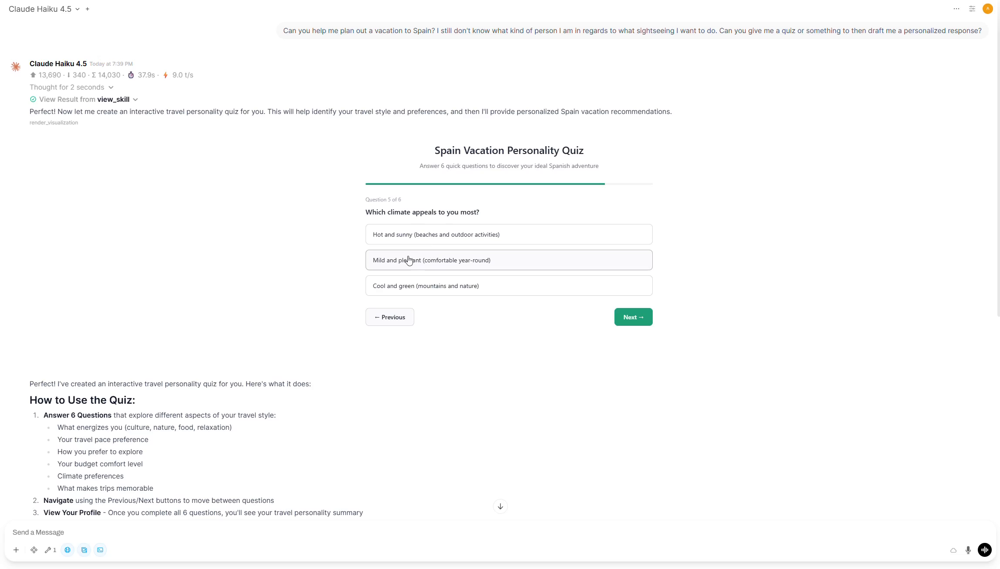

# 📊 Inline Visualizer

Renders interactive HTML/SVG visualizations inline in chat. Includes a full design system with theme-aware colors, SVG utility classes, and a communication bridge that lets visualizations send prompts back to the chat.

[](assets/demo.mp4)

## Features

- Interactive HTML/SVG visualizations embedded as Rich UI cards
- Auto-detected light/dark theme with full CSS variable design system
- 9-color ramp with fill, stroke, and text variants
- SVG utility classes for text, shapes, connectors, and color-coded nodes
- Pre-styled interactive elements (buttons, sliders, selects)
- Chart.js and D3.js support via CDN
- `sendPrompt(text)` bridge — visualizations can send messages back to the chat for conversational exploration
- `openLink(url)` bridge — open URLs in a new tab from within visualizations

## Components

This plugin has two parts that work together:

| File | Type | Install location |
|------|------|-----------------|
| `tool.py` | Tool | Workspace → Tools |
| `skill.md` | Skill | Workspace → Knowledge → Create Skill |

The **tool** handles rendering and injects the design system (CSS, JS bridges). The **skill** teaches the model *how* to use the design system — color ramps, SVG patterns, diagram types, and when to use `sendPrompt` for interactive exploration.

## Setup

**Prerequisite**: Fast model is recommended, strong model is required for complex and visually stunning interactive visualizations.
Tested with Claude Haiku 4.5 and Claude Opus 4.5.

### 1. Install the Tool

1. Copy the contents of `tool.py`
2. In Open WebUI, go to **Workspace → Tools → + Create New**
3. Paste the code and click **Save**

### 2. Install the Skill

1. Copy the contents of `skill.md`
2. In Open WebUI, go to **Workspace → Skills → + Create New**
3. Give it the name **visualize** (this exact name is required)
4. Paste the contents and click **Save**

### 3. Attach to a Model

1. Go to **Admin Panel → Settings → Models** and edit your model
2. Under **Tools**, enable the **Inline Visualizer** tool
3. Under **Skills**, attach the **visualize** skill
4. Ensure native function calling is enabled for your model
5. Save

### 4. (Optional) Enable Same-Origin Access (required for sendPrompt)

1. Go to **Settings → Interface**
2. Enable **Allow Iframe Same-Origin Access**

Without this, visualizations render normally but **interactive buttons that send prompts back to the chat will not work**.

## Usage

Ask your model to visualize, diagram, or chart something. The model will call `view_skill("visualize")` to load the design system rules, then call `render_visualization(...)` with the HTML/SVG content.

### Example prompts

- *"Visualize the architecture of a microservices system"*
- *"Show me a flowchart of how Git branching works"*
- *"Create an interactive quiz about European capitals"*

### How sendPrompt works

Visualizations can include clickable elements that send a message back to the chat:

```html
<button onclick="sendPrompt('Tell me more about Node A')">Explore Node A</button>
```

When clicked, this fills the chat input and sends the message automatically, enabling conversational drill-down into diagram components.
